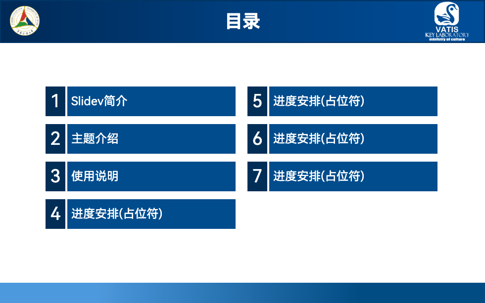
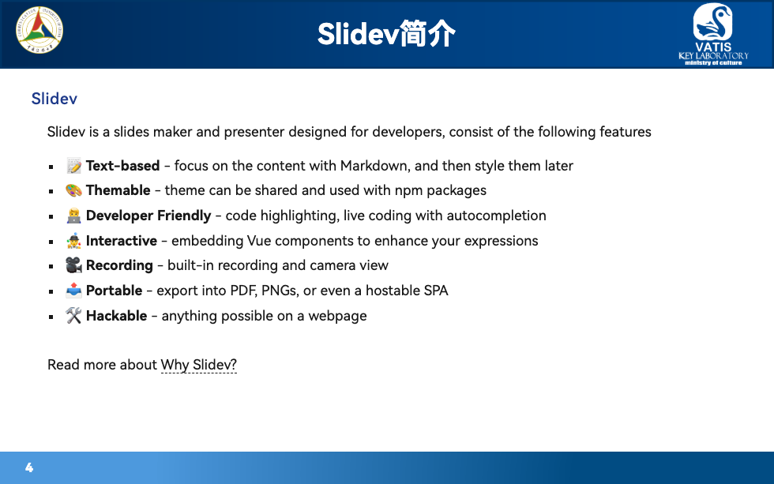
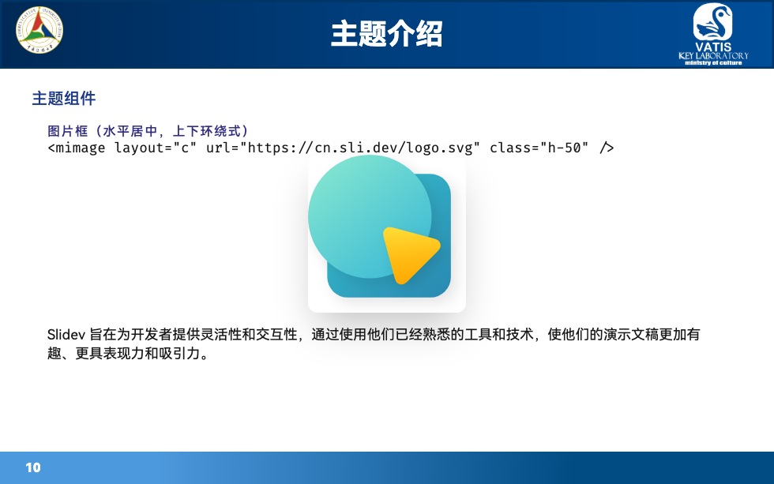
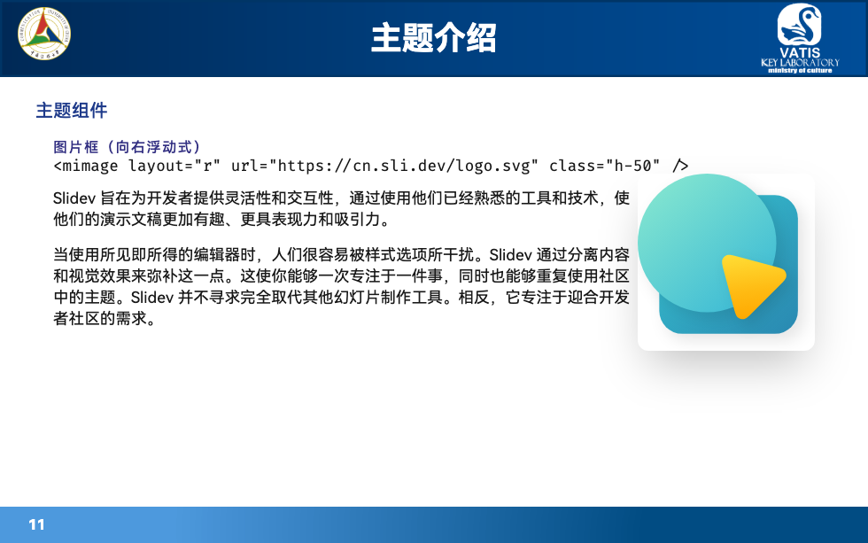
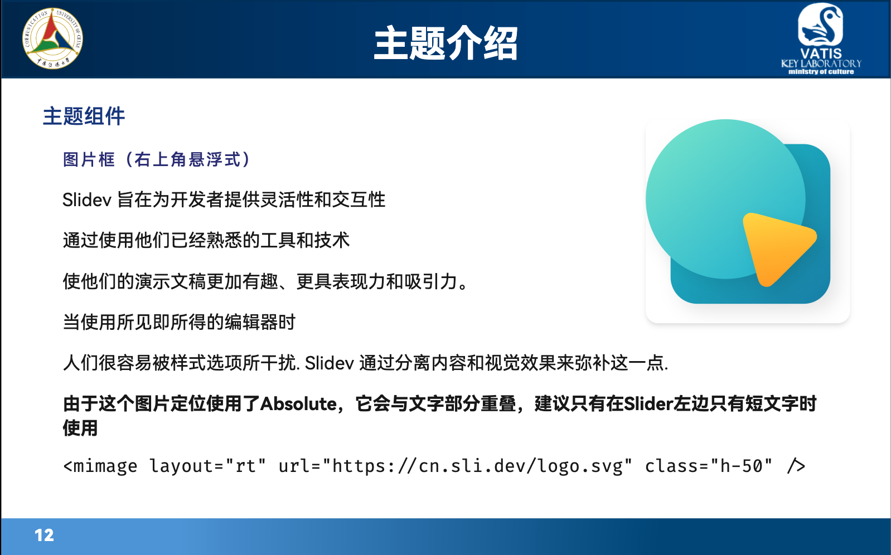

# slidev-theme-vatis

[](https://www.npmjs.com/package/slidev-theme-vatis)

这是一个 [Slidev](https://github.com/slidevjs/slidev) 的组会、简单学术报告主题.

### [Live Demo](https://slidev-theme-vatis.netlify.app/)

<!--
  Learn more about how to write a theme:
  https://sli.dev/themes/write-a-theme.html
--->

<!--
  run `npm run dev` to check out the slides for more details of how to start writing a theme
-->

<!--
  Put some screenshots here to demonstrate your theme

  Live demo: [...]
-->

## Install

Add the following frontmatter to your `slides.md`. Start Slidev then it will prompt you to install the theme automatically.

<pre><code>---
theme: <b>vatis</b>
---</code></pre>

Learn more about [how to use a theme](https://sli.dev/themes/use).

## Layouts

This theme provides the following layouts:

### Cover


```
# VATIS 非官方 Slidev 模板

中国传媒大学 视听技术与智能控制系统文化和旅游部重点实验室 非官方作品
```

### 目录页



```
---
layout: contents
---
```

**注意：** 该功能与Slidev的 `<Toc>` 不同，如需使用本功能的目录，请在扉页中填写大纲：
```
contents:
  - Slidev简介
  - 主题介绍
  - 使用说明
  - 进度安排(占位符)
  - 进度安排(占位符)
  - 进度安排(占位符)
  - 进度安排(占位符)
```

### 分章节页


```
---
layout: part
id: 1
---
```

只需要填写 `id` 即可，从1开始计数。

### 正文页



正文页中可以在顶部显示章节大标题，使用时需要标注章节ID：

```
---
id: 1
---
```

## Components

This theme provides the following components:

### 滚动窗

[示例](https://slidev-theme-vatis.netlify.app/8),使用方法：

```html
<scrool h=30>
// 这里要注意空一行
...... Markdown ......
// 这里要注意空一行
</scrool>
```

等价于

```html
<div class="overflow-auto max-h-30">
// 这里要注意空一行
...... Markdown ......
// 这里要注意空一行
</div>
```

### 图片框

[示例](https://slidev-theme-vatis.netlify.app/9),使用方法：

```html
<mimage layout="c" url="URL" class="h-50" />
```

`layout` 为图片布局方式，有以下三种：
* 水平居中，上下环绕式
* 向右浮动式
* 右上角悬浮式(可能无法正常导出)

通过设置 `h` 或 `w` 可以控制图片的尺寸，默认为图片添加了圆角和阴影。

| 居中(center)(c)            | 向右(right)(r)         | 右上(rt)               |
| -------------------------- | ---------------------- | ---------------------- |
|  |  |  |


## 已知问题

* 在Mac与iPad上的元素定位可能会不大一致
* 导出为pdf时，每页下方会有一条白线
* 导出为pdf时，最后一页下方会有一块白色区域，可以在最后插入空白页并删除pdf中的空白页解决
* 图片阴影在某些PDF阅读器中可能显示不正确
* 右上角悬浮的图片样式可能无法正常导出

在该主题中使用了许多图片资源，当全局安装Slidev、本主题使用时，会导致图片资源不能被正常解析。可以考虑将 `public` 文件夹下的图片拷贝到 `.md` 的 `public` 目录，或将图片资源上传到自己的图床，并修改模板中的链接。


## Contributing

- `npm install`
- `npm run dev` to start theme preview of `example.md`
- Edit the `example.md` and style to see the changes
- `npm run export` to generate the preview PDF
- `npm run screenshot` to generate the preview PNG
